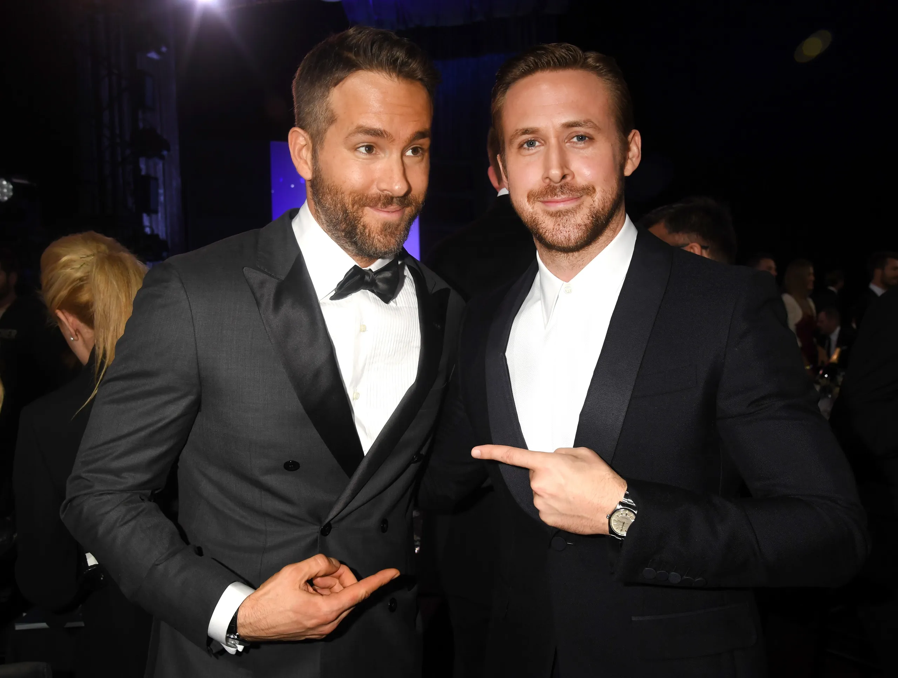

<h2> Ryan vs Ryan </h2>
<table id="ryan-v-ryan">
<thead>
  <tr>
    <th> <h3> Ryan Reynolds </h3></th>
    <th> <h3> Ryan Gosling </h3></th>
  </tr>
</thead>

 <tbody>
        <tr>
          <td>
            <h4>  Strengths  </h4>
            <ul>
              <li>good father</li>
              <li>funny</li>
              <li>dated Alanis Morissette</li>
            </ul>
             
            <h4>  Weaknessess  </h4>
            <ul>
               <li>singing</li>
              <li>Green Lantern movie</li>
              <li>tennis backhand</li>
            </ul>  
          </td>
          <td>
            <h4>  Strengths  </h4>
            <ul>
              <li>builds houses</li>
              <li>is a real boy</li>
              <li>never dated Alanis Morissette</li>
            </ul>
             
            <h4>  Weaknessess  </h4>
            <ul>
              <li>Mickey Mouse club</li>
              <li>cries a lot</li>
              <li>not Ryan Reynolds</li>

            </ul>
          </td>
        </tr> 
        </table>

